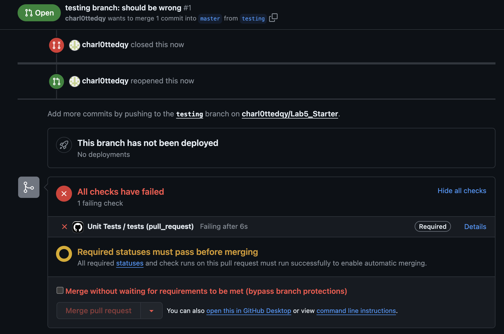
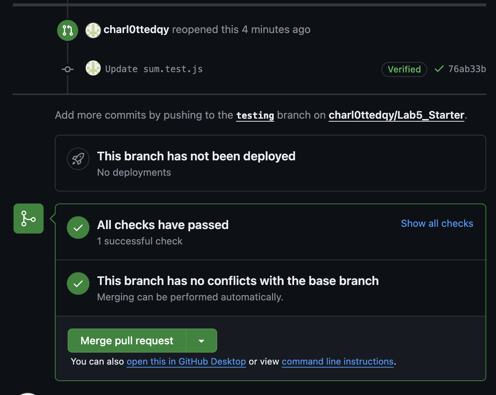

# Lab 5 - Starter
**Charlotte Dong A16899597**

**Links to Expose and Explore websites**

**Explore Part 3 Short Answers**
1. No, I would not use a unit test to test the message feature of a messaging app since it might involve multiple components to work together to make it function correctly.
2. Yes, I would use a unit test to test the max message length because it is a specific and isolated feature.

**Explore Part 3 Screenshots**
1. myError

3. merged

